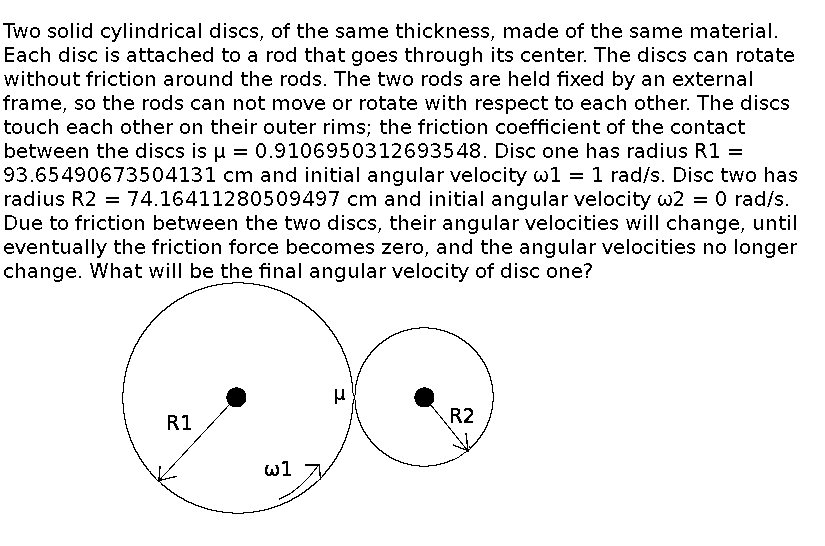

# Project Nerdsnipe

At the end of 2017, it became clear I would be switching jobs to work for a
Bitcoin company. At my previous job there was a bit of a custom of some people
to send riddles to be solved by other people, and my new employer already once
had an action where they posted Bitcoin-rewarded puzzles on the internet.
I figured it would be a fun project to make a puzzle for this occasion, and
I followed the idea "if it's worth doing, it's worth over-doing" in creating the
puzzle.

This repository contains the source code I used to generate the puzzle; the rest
of this document gives a walk-through of the puzzle. You should stop reading
here if you don't want to read spoilers.

# Part 0: the image

The only thing provided in the first step is an image of a cat playing with a
laser light; no further clues are provided on how to proceed.

The text introducing the puzzle points to the original author and source of the
image. This was made necessary by the Creative Commons license terms of the
original image, but it does provide a clue: the original author seems to have
nothing to do with me or Bitcoin or Bitcoin puzzles, so the original image is
probably not part of the puzzle. Since the puzzle image and the original image
look indistinguishable, whatever is needed to solve the puzzle must be present
in some (nearly) invisible differences. In other words: it is likely a case of
steganography, the art of hiding some data inside another piece of data.

Now, the puzzle image is provided as a .png file, unlike the original image,
which was a .jpg file (more appropriate for photographs). The .png file contains
essentially no meta-data, and most steganographic tools are excluded because
they only work on .jpg files. However, the .png file has one advantage for
steganography: it is lossless, so even the most insignificant, nearly invisible
differences in pixel values are preserved. These differences can be used for
hiding other pieces of data, without visibly altering the image. In this puzzle,
only the least significant bit of each color value is used for hiding
information.

Now each pixel has three color values: red, green and blue, so you can store
three sets of data. This puzzle does this, and each piece of data leads to a
different step of the puzzle. The order in which bits are placed in pixels is
simply (latin) reading order, left to right and top to bottom. In order to
interpret the hidden data, each set of 8 bits (read from 8 pixels) should be
interpreted as a byte.

In order to better hide the data, and not visibly distort the image, it is made
to look random. Normally, in steganography, I would do this with a strong
encryption algorithm, but this would make the puzzle impossible to solve, so I
used a different approach here. The data hidden in the green values is
compressed using gzip, making the distribution of its bit values close to
uniform. The data hidden in the other values is XORed with the hidden bits in
the corresponding green pixels. Since the red data contains large sections of
zeroes and large sections of ones, this results in XORed data that is sometimes
the same and sometimes opposite to the green data. When visualizing where the
bits are different, a pattern should emerge in the red data, giving sufficient
clues to the puzzler that XORing was indeed a useful approach. The puzzler can
then successfully try the same approach on the blue data.

To make it a little bit easier for the puzzler, the ASCII text
"You're on to something:"  was added to the green data. Additionally, the data
sets were repeated over and over again, so for instance the green data looks
like "You're on to something:" + gzip file + "You're on to something:" + gzip
file + ... and so on. Repetition of data should make it easier to detect that
something special is going on, and also prove that no other data is hidden.
I could also have opted for appending random data to the hidden data, making
the puzzle more difficult.

The text "You're on to something:" was indeed picked up by some
steganography-detecting tools. Many (most?) people apparently never tried these
tools and hence never found anything; a few people reported detecting this
text, but got no further. Some people detected the text, and also found the
gzip file hidden together with the text in the green bits. To my knowledge,
nobody spontaneously found the right way to analyze the other color components,
without first getting the hint that there is more to be found in the image than
just the gzip file.

One final note about the cat image: I deliberately chose a cat image, because
the internet has a habit of hosting huge numbers of cat images. This enormous
volume makes cat images a primary candidate for data hiding; this puzzle is just
an early test case. I chose a cat playing with a laser light because, first of
all, what is more meme-y than this idea?, and secondly, it kind of symbolizes
what I'm doing here: the puzzle is my "laser pointer", and the puzzlers are
cats chasing it. Since I'm not currently owned by a cat, I needed to download
and use someone else's cat image.

# Part 1: the maze

The file type of the gzip file can be found, for instance with the `file`
utility in Linux. The filename of the file contained in the gzip file
(`amaze.py`) is stored in plaintext, so it was already found by some people
with the steganography tools. The gzip file indeed decompresses into a Python
program.

When running the program, it waits for input, without giving the puzzler any
explanation of what is expected. When providing some random input, the program
terminates with an exception.

What the puzzler should do here is to investigate the Python code. The code
contains no comments, but it is less than 100 lines long, and the names of
functions, variables etc. are not completely obfuscated, so with some reverse
engineering, a puzzler can figure out that it generates a 3D maze, and requires
input that contains a sequence of numbers that represent directions (0 = left,
1 = right and so on). If a correct path is provided (that doesn't bump into
walls), the provided input is hashed, the hash is XORed with some data in
the Python file, and the result is returned as output.

There are multiple successful routes through the maze (including walking back
and forward unlimited numbers of times), but of course there is only one
route that results in a usable output. Since this is the shortest route, it
turned out in practice that the remaining puzzlers had no trouble finding
this solution; at least, this part did not result in any questions.

With the correct input, the output of the program is the name of a TOR hidden
service, containing the next part of the puzzle.

# Part 2: Brainfuck

The TOR hidden service serves a simple web page to the puzzler, where it asks
the puzzler to enter a program; it does not specify what kind of program.
When entering something random as a program, the website usually (but not
always!) accepts the program without syntax errors, and returns output:

* The input that was given to the program
* The output that was expected from the program
* The actual output of the program

All these are written as hexadecimal values; the input and expected output are
32 bytes long, and are seemingly random. Usually (but not always!)
a randomly given program results in an empty output.

What is important here is the exceptions to the most common behavior:

* When square brackets are not matched, a syntax error results. Apparently,
  square brackets are an important syntax element.
* Some programs do result in some output (usually zero-valued bytes).
  Making variations in a program should reveal that the period character
  results in output.

Such hints, together with the fact that otherwise there are never any syntax
errors, should reveal that this is not an ordinary programming language, and
that commands usually exist of single characters. Some puzzlers might fail here,
but puzzlers who are already familiar with 'esoteric programming languages'
might immediately recognize the famous Brainfuck programming language.
As it turned out, some puzzlers didn't need any help in recognizing this as
Brainfuck.

There are some small variations between different Brainfuck implementations,
for instance in the cell size (8 bits here), whether cell values wrap (yes),
memory size (30 000 cells here), and whether the memory wraps (yes). To protect
the service, there are some additional restrictions on the size of the program
and on the number of instructions that can be executed before the program is
terminated. The puzzler might run into one of these limitations; this could lead
to the discovery that the Brainfuck implementation was already placed on Github
by the author of the puzzle.

As it turned out, there was one unintended limitation: because the service was
operated from a Raspberry Pi with limited memory and no swap space, large
programs that were still within official size limits failed to compile. As a
result, the effective limit on program size was much smaller than the intended
limit. I tested the set-up with my own solution (which was small enough to
compile successfully), but one puzzler came up with another solution that failed
to compile because of this.

The next thing to determine is what the program should do. Simply hard-coding
the output won't work, since it is expected to be different on every new run.
So, the output must be some function of the input. Apparently, it wasn't too
difficult for some puzzlers to figure out that the expected output is always
the SHA256 of the input; maybe because I already used SHA256 quite openly
in the previous part of the puzzle. Also, both input and output are exactly 256
bits long.

Most remaining puzzlers got stuck at this point for a long time, knowing
exactly what was expected (implementing SHA256 in Brainfuck), but not knowing
how to do it, or not being prepared to put all the hard work into doing it.
I noticed (at least) one puzzler repeatedly running very simple programs with
a script, probably to try to find patterns in the input data. I don't think
this approach was successful, and the input data is supposed to be
cryptographically secure random.
I provided one bit of help: under the same Github account where I placed the
Brainfuck compiler, I also placed a Brainfuck macros language, which can make it
a little bit easier to program in Brainfuck. I specifically developed this
macros language to be able to come up with a solution myself: I wanted to make
sure it was actually possible to make a solution within the limits of my
Brainfuck implementation.

The way how I implemented SHA256 was to start with pseudo-code from Wikipedia,
and then step-by-step implement it, and at the same time building up a library
of macros for whatever functions were needed. The esoteric languages wiki was
of great help for providing algorithms, for instance for implementing arrays,
or for bitwise boolean operations. My memory map consisted of global variables,
followed by stack space, followed by array space (with every array having a
fixed index offset in the array space). In hindight, a memory map where stack
and array space are on opposite sides of the global variables, growing in
opposite directions, would have been more convenient.

One source of inspiration for this part of the puzzle was the fact that Bitcoin
mining is now completely taken over by a concentration of miners using ASICS.
Some people long back to the times when you could still mine effectively using
less efficient CPU miners. I thought: why not go even further? What can we do to
make mining even less efficient? That would be Brainfuck, of course. Thanks to
this Puzzle, we now have several SHA256 implementations in Brainfuck that can be
used for Bitcoin mining.

# Part 3: Values

When an entered Brainfuck program is successful, the Brainfuck page provides a
link to another page on the same hidden service. This page asks the puzzler to
enter a value in SI units, without any clues on where to retrieve these values.
Entering a random value just results in the page reporting that the entered
value was not close enough.

Maybe of interest to the puzzler: the entire page is Javascript-only, with no
server-side processing. However, this is not enough to reverse engineer what
values are needed, since the output data and the value range check are based,
in different ways, on secure hashes of the input data. In a sense, this is
similar to the maze part.

The Javascript code only uses the ten most significant decimals of the value -
in hindsight, this was not enough: it gives about 33 bits of entropy, while
nowadays typically more than 100 bits is recommended for cryptographically
secure passphrases. This left an unintended possibility of brute-forcing the
values to enter, without solving certain parts of the puzzle.

# Part 4: Rotating discs

Those who came up with the idea of XORing the hidden data in the red and the
green pixels, obtained a one-bit-per-pixel image that, while containing some
visible patterns, is still heavily distorted. The distortion can be compensated
by shifting the pixels of each row 64 pixels more than the pixels of the
previous row. The resulting undistorted image contains a physics problem:

The interesting thing about this problem is that the standard approaches to such
a problem, like conservation of energy or (angular) momentum, do not apply here.

Conservation of energy does not apply because energy is lost due to friction
between the discs (it is converted to heat; the amount of heat to disappear due
to radiation, conduction etc. cannot be determined with the given data).

Conservation of angular momentum does not apply either: there is an upward force
applied by disc 1 to disc 2; to keep disc 2 from accelerating upwards, the rod
that keeps disc 2 in place applies an equally sized downward force to disc 2.
The same way, a downward force is applied by disc 2 to disc 1, and disc 1's rod
applies an upward force to disc 1. The upward and downward forces applied by the
two rods together form a torque, which is applied by the external world on this
system. This torque changes the angular momentum, so conservation of angular
momentum does not apply.

If you were to assume conservation of energy, you would make the following
calculation:

    m1 = R1^2
    m2 = R2^2

    I1 = m1*R1^2 = R1^4
    I2 = m2*R2^2 = R2^4

    Eb = I1 * w1b^2              = R1^4 * w1b^2
    Ee = I1 * w1e^2 + I2 * w2e^2 = R1^4 * w1e^2 + R2^4 * w2e^2

    w1e * R1 = -w2e * R2

    Ee = Eb [naive]
    R1^4 * w1e^2 + R2^4 * [w1e * R1/R2]^2 = R1^4 * w1b^2
    [R1^4 + R2^4 * (R1/R2)^2] * w1e^2 = R1^4 * w1b^2
    [R1^4 + R2^2 * R1^2] * w1e = R1^4 * w1b^2
    w1e^2 = w1b^2 * R1^4 / [R1^4 + R2^2 * R1^2]
          = w1b^2 * R1^2 / [R1^2 + R2^2]
    w1e = w1b * R1 / sqrt(R1^2 + R2^2)
        = 0.7839617157352895 rad/s [wrong]

If you were to assume conservation of angular momentum, you would make the
following calculation:

    m1 = R1^2
    m2 = R2^2

    I1 = m1*R1^2 = R1^4
    I2 = m2*R2^2 = R2^4

    Lb = I1 * w1b            = R1^4 * w1b
    Le = I1 * w1e - I2 * w2e = R1^4 * w1e - R2^4 * w2e [naive]

    w1e * R1 = -w2e * R2

    Le = Lb [naive]
    R1^4 * w1e - R2^4 * w2e = R1^4 * w1b
    R1^4 * w1e - R2^4 * [-w1e * R1/R2] = R1^4 * w1b
    w1e * [R1^4 + R2^4 * (R1/R2)] = R1^4 * w1b
    w1e = w1b * R1^4 / [R1^4 + R2^4 * (R1/R2)]
        = w1b * R1^4 / [R1^4 + R2^3 * R1]
        = w1b * R1^3 / [R1^3 + R2^3]
        = 0.6681898409601859 [wrong]

Finding the correct value can be done, for instance, this way:

Whatever the force is, there is a fixed ratio between the change in angular
velocities of the two discs:

    I1 = R1^4
    I2 = R2^4
    |dw1| = |F| * R1 / I1 = |F| / R1^3
    |dw2| = |F| * R2 / I2 = |F| / R2^3
          = |dw1| * (R1/R2)^3

    No matter how large the force is or how it changes in time, when integrating
    small changes in angular velocity over time, this ratio will always remain the
    same. This will be the end situation:

    |w1e| * R1 = |w2e| * R2
    (|w1b| - |dw1|) * R1 = |dw2| * R2
    (|w1b| - |dw1|) * R1 = [|dw1| * (R1/R2)^3] * R2
    |w1b| * R1 - |dw1| * R1 = |dw1| * R2 * (R1/R2)^3
    |w1b| * R1 = |dw1| * [R2 * (R1/R2)^3 + R1]
    |w1b| = |dw1| * [R1^2 / R2^2 + 1]
    |dw1| = |w1b| / [R1^2 / R2^2 + 1]
          = |w1b| * R2^2 / [R1^2 + R2^2]

    |w1e| = |w1b| - |dw1|
          = |w1b| * {1 - R2^2 / [R1^2 + R2^2]}
          = |w1b| * {[R1^2 + R2^2 - R2^2] / [R1^2 + R2^2]}
          = |w1b| * R1^2 / [R1^2 + R2^2]

          = 0.6145959717386188 rad/s

Entering this value into the Values page yields the following data:

37107599e317f32f53e58571c857a45a4e1d1d88a46ae4983d3160f9962f5c0a

Note: this problem is based on this video: https://www.youtube.com/watch?v=GPAHZHW3-vg

# Part 5: The QR code

XORing the green and blue data results in the same bytes repeated over and over
again. This sequence contains only a couple of different byte values.
It should not be too difficult for the remaining puzzlers to recognize MS-DOS
style line endings (value 13 followed by value 10). When viewing the data as a
text file, a problem arises: many of the remaining characters have a value
greater than 127, so it is needed to figure out what code page is used (it is
not UTF-8, like most modern systems).

Puzzlers who try something really old-skool (the default code page of MS-DOS)
discover something really modern: a QR code, in this case visualized with MS-DOS
block drawing characters. When scanned, the QR code returns the following text:

P2SH: OP_HASH160 1LGLVoSNni64DNP8pnZZxZSEdk2rbJ8s4J OP_EQUALVERIFY OP_DUP OP_HASH160 1KseMAwvPwhJQyUxmBPcK99s7wy7qGvdfa OP_EQUALVERIFY OP_CHECKSIG

# Part 6: The transaction

Those familiar with Bitcoin scripts should immediately recognize the OP-codes
in the QR code; other puzzlers should be able to figure this out by googling.
When following the Pay to Script Hash (P2SH) method, the code corresponds to
this Bitcoin address:

3HvRbQU3CNVSasRpdLwRWp8WAhhhfmNriE

The address had 0.25 BTC deposited on it, which was unspent when the puzzle was
not yet solved - an obvious hint that this was the reward. The P2SH script shows
what is needed to claim the reward:

* A piece of data that hashes to 1LGLVoSNni64DNP8pnZZxZSEdk2rbJ8s4J
* A Bitcoin private key with a public key that hashes to 1KseMAwvPwhJQyUxmBPcK99s7wy7qGvdfa

As it turns out, the hex code from part 4 is the required private key - the
other piece of data is still needed.

Looking at the funding transaction (1b36b1487563bc08a2a2326a6412924d52f15fe7cbd47140d1c4c790ef3fbb65),
you can see it has another output: an OP_RETURN output containing the following
text:

Resistance of knight move in infinite 2D rectangular grid of 1 Ohm resistors 

# Part 7: The grid of resistors

As should be clear now, this is another physics problem, with an answer that
should be entered in the values page of part 3.

This physics problem is actually surprisingly hard - I didn't manage to figure
it out by myself. Some puzzlers might recognize the problem: it was mentioned
in the XKCD comic "nerd sniping" (https://www.xkcd.com/356/). You can find a
solution on the internet:

http://www.mathpages.com/home/kmath668/kmath668.htm

In short: the answer is 4*pi-0.5 = 0.773239544735162 Ohm. On the values page,
this yields the following data:

446f6e27742073746f726520757020747265617375726573206f6e20656172746821204d6f74687320616e6420727573742063616e2064657374726f79207468656d2c20616e6420746869657665732063616e20627265616b20696e20616e00000000000000000000000000

# Part 8: Holy scripture

Now, this was *supposed* to be a piece of data that hashes to
1LGLVoSNni64DNP8pnZZxZSEdk2rbJ8s4J; in other words, it was supposed to be the
last piece of the puzzle. However, due to an error I made somewhere when making
this puzzle, the last part of the data was missing (this is where you see the
zero-valued bytes). Luckily, the epic team of puzzlers that managed to reach
this level quickly discovered that the still-readable part was not a random
sequence of bytes - it is in fact a quote from the (Contemporary English Version
of) the Bible. The full verse, Matthew 6:19, part of the sermon on the mount,
reads:

Don't store up treasures on earth! Moths and rust can destroy them, and thieves can break in and steal them.

With this, the puzzlers not only found the last piece of data needed to make
their Bitcoin transaction: they also found something that might be considered
the ultimate Christian investment advice; something to consider when dealing
with large amounts of bitcoin.

Finally, it should be noted that the private key found in part 4 is not truly
random either: it is the SHA256 hash of another verse. In my view, the entire
sermon is worth a read though, starting at Matthew 5; however, this is not a
requirement for solving the puzzle. If someone, somehow found that both the
private key and the hash pre-image could be found through the Bible, that
person wouldn't have had to solve large parts of the puzzle, including the
Brainfuck part. I tried to estimate the effort required in trying this
unlikely idea, together with a whole range of unsuccessful, similarly unlikely
ideas, and my estimate is that this would probably be more work than just
solving the puzzle the regular way. So, while I did provide an alternative
route, it wasn't a true short-cut.

